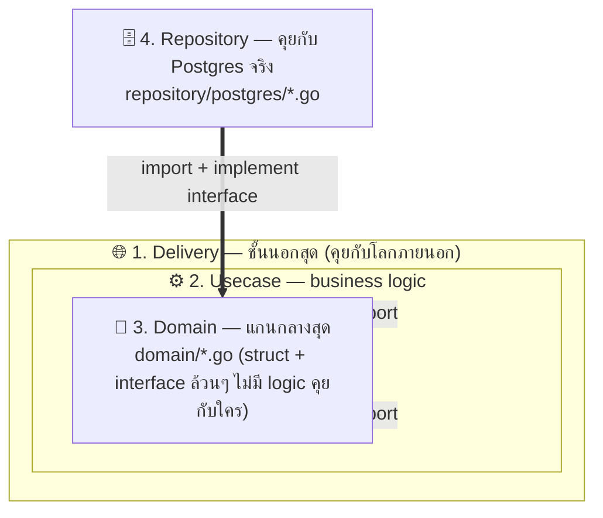
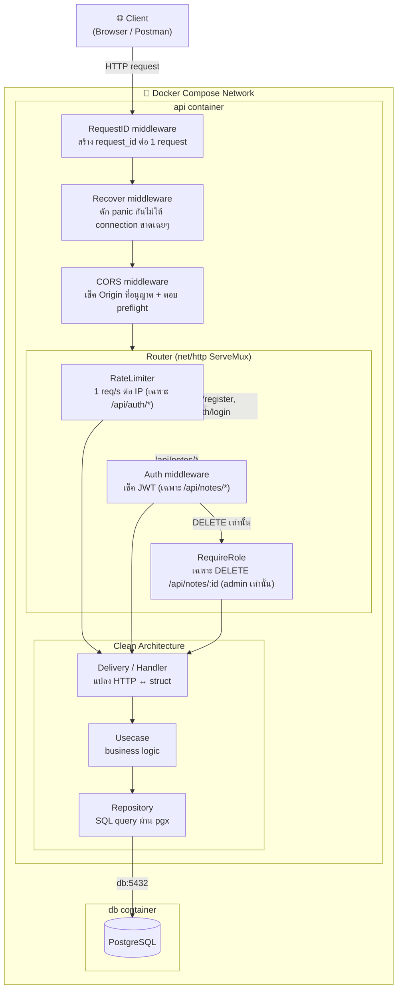

# 🚀 Go Minimal Backend (Clean Architecture)

โปรเจกต์นี้คือ Template สำหรับสร้าง Backend ด้วย **Go 1.26.1** แบบ Minimal ไม่พึ่งพา Framework หนักๆ (ใช้ Standard Library `net/http`) แต่จัดโครงสร้างแบบ **Clean Architecture** รัดกุมเหมือน .NET เพื่อให้โปรเจกต์ขยายได้ง่ายและดูแลรักษาได้ในระยะยาว

## 📂 โครงสร้างโฟลเดอร์โดยสังเขป
โปรเจกต์นี้แบ่งออกเป็น 3 โฟลเดอร์หลัก:
1. `cmd/` - จุดเริ่มต้นของโปรแกรม (ไฟล์ `main.go`)
2. `internal/` - โค้ดส่วนตัวของแอปเรา (คนอื่น import ไปใช้ไม่ได้) **หัวใจหลักอยู่ที่นี่**
3. `pkg/` - โค้ดเครื่องมือส่วนกลาง (เช่นตัวแปลง JSON, การทำ JWT)

## 🔄 การไหลของข้อมูล (Data Flow)
เวลาที่มี Request เข้ามาผ่าน API ข้อมูลจะไหลเป็นชั้นๆ ดังนี้ (แบบเดินรถทางเดียว):

**HTTP Request** -> `Delivery` (รับ/ส่งข้อมูล) -> `Usecase` (คิดคำนวณ) -> `Repository` (คุยกับ DB)

> 💡 **กฎเหล็ก**: วงแหวนวงนอกสุดรู้จักรวงใน แต่วงในสุดห้ามรู้จักวงนอก (เช่น `Domain` ห้าม import `Usecase`, และ `Usecase` ห้าม import `Delivery`)

ให้เห็นภาพชัดๆ ว่า "ชั้นๆ" ที่ว่านี้จริงๆ แล้วหน้าตาเป็นกล่องซ้อนกัน (Domain อยู่แกนกลางสุด ไม่รู้จักใครเลย ยิ่งอยู่วงนอกยิ่งรู้จักวงในได้):



**อ่านยังไง:**
- `Delivery` ห่อ `Usecase` ห่อ `Domain` ไว้เป็นกล่องซ้อนกัน (nested) = ยิ่งอยู่ข้างในยิ่ง "ไม่รู้เรื่อง" อะไรข้างนอกเลย `Domain` เป็นแค่ struct/interface เฉยๆ ไม่ import อะไรทั้งนั้น
- `Repository` ไม่ได้ถูกห่ออยู่ข้างในเพราะมันเป็นแค่ "คนนอกที่มา implement สัญญา (interface) ที่ `Domain` กำหนดไว้" (เช่น `domain.NoteRepository`) นี่คือหลักการ **Dependency Inversion** — `Domain` บอกว่า "ต้องมีเมธอดอะไรบ้าง" ส่วนใครจะ implement (Postgres, MySQL, mock ตอนเทส) ก็ไปทำเอา `Domain` ไม่ต้องรู้จักเลย
- ลูกศรทุกเส้นชี้ **เข้าหา `Domain`** เสมอ ไม่มีทางที่ `Domain` จะ import ย้อนกลับออกไปหา `Usecase`/`Delivery`/`Repository` — ถ้าเห็น import ย้อนทางนี้เมื่อไหร่แปลว่าโครงสร้างพัง

## 🔐 ระบบสิทธิ์ผู้ใช้งาน (RBAC)
ระบบได้ถูกติดตั้ง **Role-Based Access Control** เรียบร้อยแล้ว:
- **Admin**: ถูกสร้างไว้ให้อัตโนมัติ (Seed Data) ตอนรันระบบครั้งแรกด้วย Database Migration คุณสามารถ Login ด้วย `username`: `admin` และ `password`: `admin123` เพื่อรับสิทธิ์ Admin ทันที (ไม่ต้องสมัคร)
- **User**: ทุกๆ ครั้งที่มีการสมัครสมาชิก (Register) ทุกคนจะได้สิทธิ์เป็น `user` ธรรมดาหมด 
- ทุกๆ ครั้งที่ Login ตัว JWT Token จะฝังค่า Role เอาไว้ให้ 
- **ตัวอย่างการห้ามบาง Route:** เส้นทาง `DELETE /api/notes/{id}` ถูกจำกัดสิทธิ์ใน `router.go` ให้เข้าถึงได้เฉพาะคนที่ถือ Token ที่มีสิทธิ์ `admin` เท่านั้น (ผ่าน `middleware.RequireRole("admin")`)


## 🛠 คำสั่ง Go ที่ใช้บ่อยในโปรเจกต์นี้
รวบรวมคำสั่งพื้นฐานและคำสั่งที่ต้องใช้เป็นประจำ:

```bash
# 1. รันโปรเจกต์ (สำหรับตอนพัฒนา)
go run cmd/api/main.go

# 2. คอมไพล์โปรเจกต์ (เอาไว้ไปรันจริงบน Production)
go build -o api.exe cmd/api/main.go 
# บน Linux/Mac จะใช้: go build -o api cmd/api/main.go

# 3. โหลด Package ทั้งหมดให้ครบถ้วน (เผื่อไปเปิดเครื่องอื่น)
go mod tidy

# 4. ทดสอบความถูกต้องของ Syntax และโค้ดเบื้องต้น
go vet ./...

# 5. รัน Unit Test (ถ้ามีการเขียนไฟล์ _test.go ในอนาคต)
go test ./... -v
```

## 🚀 วิธีเริ่มต้น (Quick Start)
1. สั่งรัน Database ขึ้นมาก่อนด้วย `docker compose up -d`
2. ตรวจสอบตั้งค่าฐานข้อมูลในไฟล์ `.env` (สลับ username/password ให้ตรงกับเครื่องคุณ ถ้าไม่ได้ใช้ค่า default ของ Docker)
3. รันคำสั่ง `go run cmd/api/main.go`
4. ลองยิง API ผ่าน Postman ได้เลย!


## ✅ เช็คลิสต์ระบบที่มีในเทมเพลตนี้

### ทำแล้ว
- ✅ Clean Architecture 4 ชั้น (`domain` / `usecase` / `repository` / `delivery`)
- ✅ JWT Authentication + RBAC (`admin` / `user`) — `internal/1delivery/http/middleware/auth.go`
- ✅ CORS middleware ตั้งค่า origin ที่อนุญาตผ่าน `.env` (`CORS_ALLOWED_ORIGINS`) — `middleware/cors.go`
- ✅ Input validation ระดับ field (required/ความยาว) ทำไว้เป็นแนวทางที่ `notes` — `handler/note_handler.go` (`Validate()`)
- ✅ Error response กลาง พร้อม `request_id` ทุก error ไม่หลุด error message ดิบไปหา client — `pkg/response/json.go`
- ✅ Request ID middleware — ผูก ID เดียวกันไว้ทั้ง response และ server log ไล่ debug ได้ — `middleware/requestid.go`
- ✅ Panic recovery middleware — handler panic แล้วยังตอบ client เป็น 500 ปกติ ไม่ใช่ connection reset — `middleware/recover.go`
- ✅ `http.Server` timeout (`ReadHeaderTimeout`/`ReadTimeout`/`WriteTimeout`/`IdleTimeout`) กัน slow client ค้าง connection — `cmd/api/main.go`
- ✅ Graceful shutdown (ดัก `SIGINT`/`SIGTERM` แล้วรอ request ค้างจบก่อนปิด) — `cmd/api/main.go`
- ✅ Rate limiting ต่อ IP ที่ `/api/auth/login` และ `/api/auth/register` กัน brute-force — `middleware/ratelimit.go`
- ✅ Auto-create ตาราง + seed admin user ตอน boot — `internal/3repository/postgres/db.go`

### ยังไม่มี (รู้ไว้ก่อนเอาไปใช้งานจริง/production)
- [ ] Migration tool จริงแบบ versioning/rollback (ตอนนี้เป็นแค่ `CREATE TABLE IF NOT EXISTS` แก้ schema ตารางเดิมต้องเขียน SQL เอง)
- [ ] Pagination บน list endpoint (ตอนนี้ `GET /api/notes` ดึงมาหมดทุก row ของ user)
- [ ] Access log middleware (log ทุก request อัตโนมัติ ไม่ใช่แค่ตอน error)
- [ ] Automated tests (unit/integration) — ยังไม่มีไฟล์ `_test.go` เลย
- [ ] Health check endpoint (เช่น `/healthz`) — จำเป็นถ้า deploy หลัง load balancer/k8s

## 🗺️ แผนภาพระบบ (System Diagram)

ไล่ตั้งแต่ request เข้ามาจาก client จนถึง DB ว่าผ่านอะไรบ้าง (เรียงตามลำดับ middleware จริงใน `router.go`) และวางอยู่ตำแหน่งไหนของ Docker network:



**อ่านแผนภาพนี้ยังไง:**
- ลูกศรจาก `Client` ไล่ลงมาตามลำดับ = ลำดับ middleware จริงที่ทุก request ต้องผ่าน (นอกสุดไปในสุด)
- `RateLimit` กับ `Auth` แยกเส้นกันเพราะครอบคนละ route (`/api/auth/*` ไม่ต้อง login แต่โดน rate limit / `/api/notes/*` ต้อง login แต่ไม่โดน rate limit)
- ฝั่ง `Clean Architecture` คือกฎเหล็กเดิม: `Handler` รู้จัก `Usecase`, `Usecase` รู้จัก `Repository` เป็นทางเดียว ห้ามย้อนกลับ
- `api` กับ `db` เป็นคนละ container คุยกันผ่านชื่อ service (`db:5432`) ไม่ใช่ `localhost` (ดูรายละเอียดใน `ReadDocker.md`)
